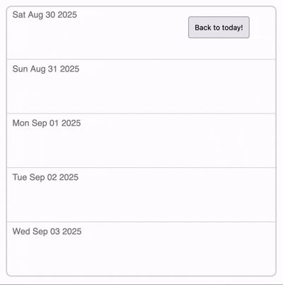

A headless React hook for building infinite scroller components that display procedurally generated data. Perfect for use cases like date scrollers, where row data is generated dynamically rather than fetched from a dataset.

- ⚡️Full row/column virtualization for buttery-smooth performance.
- ⤴️ Supports vertical and horizontal layouts.
- 📏 Supports dynamic row/column sizes.
- 🎯 A `scrollToIndex` API for instant or smooth programmatic scrolling.
- 📦 Lightweight ~ 4.95 kB when minified and gzipped.
- 🛠 Zero dependencies.
- 🎭 E2E tested and rigorously vetted for rock-solid reliability.

---

## Quick Start Guide

Follow the steps below to build your first procedural scroller component:

### 1. Install

Install the library using npm:

```
npm install react-procedural-scroller
```

### 2. Import

#### ES Modules:

```typescript
import { useProceduralScroller } from "react-procedural-scroller";
```

#### CommonJS:

```typescript
const { useProceduralScroller } = require("react-procedural-scroller");
```

### 3. Build UI Components

This library is headless, meaning it only manages the scrolling state and virtualization logic, giving you full freedom to design your own UI. To get started, you’ll first need to create two components: a scrollable `<Container />` element, and an `<Item />` component that will be rendered inside the container to form the rows/columns. Each item is identified by an integer index, and you can procedurally generate the item's content based on this index, as shown in the date scroller examples below:

#### Example container:

```typescript jsx
import { useProceduralScroller } from "react-procedural-scroller";
import Item from "../components/items/item.tsx";

export default function Container() {

  const { items, container } = useProceduralScroller<
    HTMLDivElement, // Type of the scrollable container element.
    HTMLDivElement // Type of each item inside the container.
  >({
    // Initial scroll position of the container.
    initialScroll: {
      index: 0, // Index of the item to scroll to initially.
      block: "center", // Alignment of the item in the viewport: "start", "center", or "end".
    },
    /* Callback to return the minimum size of each item along the relevant axis:
      - For vertical scrolling: minimum height.
      - For horizontal scrolling: minimum width. */
    getMinItemSize: () => 100,
    // Direction of scrolling: "vertical" or "horizontal"
    scrollDirection: "vertical",
    /* Optional: `initialContainerSize` defines the height of the container on the
    first page render. Without it, `items` will be null on the first render because the hook
    needs to measure the container's size before determining how many items to render.
    Providing a value makes `items` available immediately and helps avoid layout shift. */
    initialContainerSize: 200,
  });

  return (
    <div
      style={{
        display: "flex",
        flexDirection: "column", // Must match the hook's `scrollDirection`: "column" - vertical, "row" - horizontal.
        height: "500px",
        width: "500px",
        overflow: "scroll", // The container must be scrollable!
        border: "2px solid lightgrey",
        borderRadius: "10px",
        margin: "30px",
        scrollbarWidth: 'none',
      }}
      ref={container.ref} // Enables the hook to track and update the container's scroll position.
    >
      {items?.map((item) => (
        <Item key={item.index} item={item} />
      ))}
    </div>
  );
}
```

#### Example item:

```typescript jsx
import { memo } from 'react';
import { type Item } from 'react-procedural-scroller';

export default memo(
  function Item({ item }: { item: Item<HTMLDivElement> }) {

    /* Generate a date relative to today based on the item's index
       (e.g., index 0 = today, 1 = tomorrow, -1 = yesterday). */
    const date = new Date();
    date.setDate(date.getDate() + item.index);

    return (
      <div
        ref={item.ref} // Enables the hook to measure and virtualize this item.
        style={{
          minHeight: 100, // Must match or exceed the result of getMinItemSize(index) in the container.
          borderTop: '1px solid lightgrey',
        }}
      >
        <p
          style={{
            fontFamily: 'Helvetica',
            color: 'grey',
            padding: '10px',
          }}
        >
          {date.toDateString()}
        </p>
      </div>
    );
  },
  /*
   * Since an <Item /> component’s content is generated entirely from its index,
   * it is highly recommended to wrap it in React.memo with a custom comparison
   * function that prevents re-renders unless this index changes.
   */
  (prevProps, nextProps) => prevProps.item.index === nextProps.item.index,
);

```

### 4. Implement programmatic scrolling

`react-procedural-scroller` includes a `scrollToIndex` API, allowing you to scroll to any item programmatically. For example, you can use `scrollToIndex` to create a “Back to today!” button for the date scroller component from Step 2:

```typescript jsx
const { items, container, scrollToIndex } = useProceduralScroller(...)
```

```typescript jsx
<button
  onClick={() => {
    scrollToIndex({
      index: 0,
      block: 'center',
      behavior: 'smooth',
    });
  }}
>
  Back to today!
</button>
```

### 5. You're done!

Copying the examples above should result in a date scroller component like this:



---

## API Reference

### Props

<table>
  <tr>
    <th>Prop</th>
    <th>Required</th>
    <th>Type</th>
    <th>Default</th>
    <th>Description</th>
  </tr>
  <tr>
    <td><code>initialScroll</code></td>
    <td>no</td>
    <td>
<pre><code class="language-typescript">
{ 
  block: 
    | 'start' 
    | 'center' 
    | 'end'; 
  index: number;
}
</code></pre>
    </td>
    <td>
<pre><code class="language-typescript">
{
  block: 'center',
  index: 0 
}
</code></pre>
    </td>
    <td>Defines the initial scroll position of the container. <code>index</code> is the item to scroll to, and <code>block</code> determines alignment in the viewport.</td>
  </tr>
  <tr>
    <td><code>getMinItemSize</code></td>
    <td>yes</td>
    <td>
<pre><code class="language-typescript">
(index: number) => number
</code></pre>
    </td>
    <td>-</td>
    <td>Function that must be provided to the hook for virtualization to work. It returns the minimum size of each item along the scrolling axis (height for vertical, width for horizontal). The returned value does not need to be the actual size of the item, but it must be a hard lower bound—otherwise, the hook may fail to render enough items to fully cover the container, breaking virtualization.</td>
  </tr>
  <tr>
    <td><code>scrollAreaScale</code></td>
    <td>no</td>
    <td><code>number</code></td>
    <td><code>3</code></td>
    <td>The scrollable area’s size relative to the container. For example, a value of 3 makes the scrollable area at least three times the container’s size. Larger values reduce the frequency of scroll wrap events but cause more items to be rendered at once.</td>
  </tr>
  <tr>
    <td><code>minIndex</code></td>
    <td>no</td>
    <td><code>number</code></td>
    <td>-</td>
    <td>Minimum item index that can be scrolled to.</td>
  </tr>
  <tr>
    <td><code>maxIndex</code></td>
    <td>no</td>
    <td><code>number</code></td>
    <td>-</td>
    <td>Maximum item index that can be scrolled to.</td>
  </tr>
  <tr>
    <td><code>paddingAreaScale</code></td>
    <td>no</td>
    <td>
<pre><code class="language-typescript">
{
  start: number;
  end: number; 
}
</code></pre>
    </td>
    <td>
<pre><code class="language-typescript">
{ 
  start: 1,
  end: 1
}
</code></pre>
    </td>
    <td>Similar to <code>scrollAreaScale</code> but for the padding space before the first item and after the last item.</td>
  </tr>
  <tr>
    <td><code>scrollDirection</code></td>
    <td>no</td>
    <td>
    <pre><code class="language-typescript">'horizontal' | 'vertical'</code></pre>
    </td>
    <td><code>'vertical'</code></td>
    <td>Sets the scroll orientation. Must match the scrollable direction of your container.</td>
  </tr>
  <tr>
    <td><code>initialContainerSize</code></td>
    <td>no</td>
    <td><code>number</code></td>
    <td>-</td>
    <td>Optional height of the container on first render. Makes <code>items</code> available immediately and helps prevent layout shift.</td>
  </tr>
<tr>
    <td><code>validateLayouts</code></td>
    <td>no</td>
    <td>
<pre><code class="language-typescript">
{
  container?: boolean;
  items?: boolean;
}
</code></pre>
    </td>
    <td>
<pre><code class="language-typescript">
{
  container: true,
  items: true
}
</code></pre>
    </td>
    <td>
        Allows you to selectively disable the hook’s built-in layout validation checks. By default, the hook ensures that the container has a bounded size and that rendered items meet the minimum size returned by <code>getMinItemSize</code>. Setting <code>container</code> to <code>false</code> prevents the hook from throwing an error if the container size is unbounded (which can lead to infinite render loops), while setting <code>items</code> to <code>false</code> disables the check that item sizes meet the minimum required value.
    </td>
  </tr>
</table>

### Return Values

<table>
  <tr>
    <th>Return Value</th>
    <th>Type</th>
    <th>Description</th>
  </tr>
  <tr>
    <td><code>scrollToIndex</code></td>
    <td>
<pre><code class="language-typescript">
(input: 
  {
    index: number;
    block?: 
      | 'start' 
      | 'center' 
      | 'end';
    behavior?: 
      | 'smooth' 
      | 'instant';
  }
) => void
</code></pre>
    </td>
    <td>Function to programmatically scroll to a specific item. <code>index</code> is the target item, <code>block</code> determines alignment, and <code>behavior</code> controls smooth or instant scrolling.</td>
  </tr>
  <tr>
    <td><code>container</code></td>
    <td>
<pre><code class="language-typescript">
{
  ref: RefObject;
}
</code></pre>
    </td>
    <td>Object containing a <code>ref</code> to the scrollable container. Must be attached to your container element so the hook can track scroll position and virtualization.</td>
  </tr>
  <tr>
    <td><code>items</code></td>
    <td>
<pre><code class="language-typescript">
{
  index: number;
  ref: RefObject;
}[] | null
</code></pre>
    </td>
    <td>Array of items to render in the container; initially <code>null</code> on first page load.</td>
  </tr>
</table>
